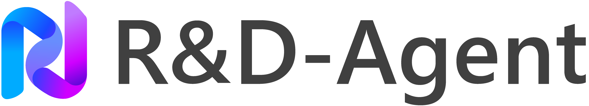
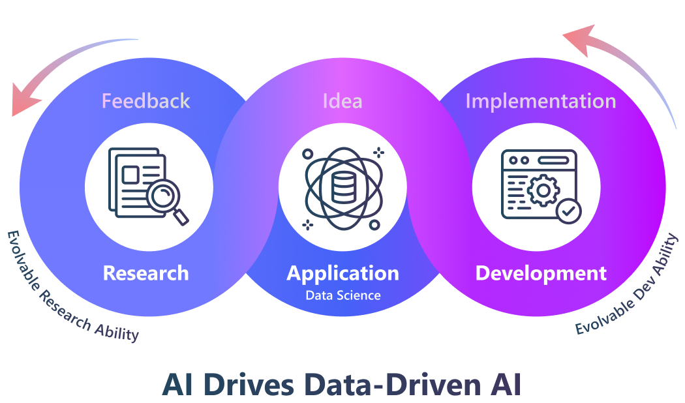
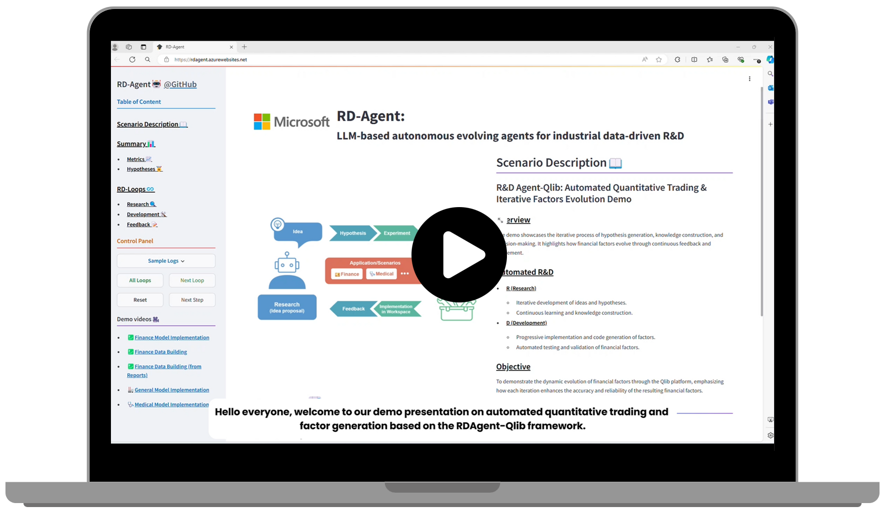
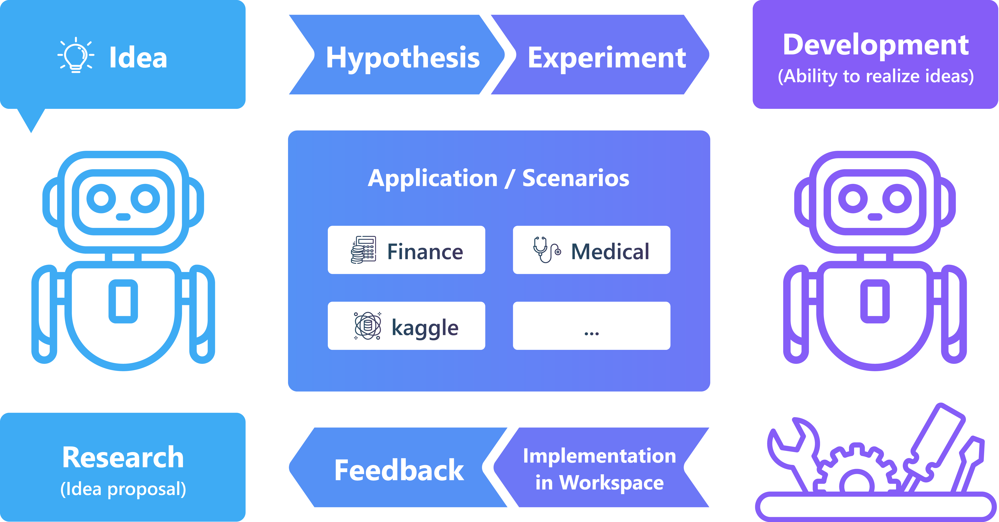

<h4 align="center">
  
  
  <a href="https://rdagent.azurewebsites.net" target="_blank">🖥️ 在线演示</a> |
  <a href="https://rdagent.azurewebsites.net/factor_loop" target="_blank">🎥 演示视频</a> <a href="https://www.youtube.com/watch?v=JJ4JYO3HscM&list=PLALmKB0_N3_i52fhUmPQiL4jsO354uopR" target="_blank">▶️YouTube</a>   |
  <a href="https://rdagent.readthedocs.io/en/latest/index.html" target="_blank">📖 文档</a> |
  <a href="https://aka.ms/RD-Agent-Tech-Report" target="_blank">📄 技术报告</a> |
  <a href="#-paperwork-list"> 📃 论文 </a>
</h3>

[](https://github.com/microsoft/RD-Agent/actions/workflows/ci.yml)
[](https://github.com/microsoft/RD-Agent/actions/workflows/github-code-scanning/codeql)
[](https://github.com/microsoft/RD-Agent/actions/workflows/dependabot/dependabot-updates)
[](https://github.com/microsoft/RD-Agent/actions/workflows/pr.yml)
[](https://github.com/microsoft/RD-Agent/actions/workflows/release.yml)
[](https://pypi.org/project/rdagent/#files)
[](https://pypi.org/project/rdagent/)
[](https://pypi.org/project/rdagent/)
[](https://github.com/microsoft/RD-Agent/releases)
[](https://github.com/microsoft/RD-Agent/blob/main/LICENSE)
[](https://github.com/pre-commit/pre-commit)
[](http://mypy-lang.org/)
[](https://github.com/astral-sh/ruff)
[](https://discord.gg/ybQ97B6Jjy)
[](https://rdagent.readthedocs.io/en/latest/?badge=latest)
[](https://github.com/microsoft/RD-Agent/actions/workflows/readthedocs-preview.yml)
[](https://arxiv.org/abs/2505.14738)

# 📰 最新动态
| 🗞️ 新闻        | 📝 描述                 |
| --            | ------      |
| ICML 2026 录用 | 我们很高兴地宣布，我们的论文 [FT-Dojo: Towards Autonomous LLM Fine-Tuning with Language Agents](https://arxiv.org/abs/2603.01712) 已被 ICML 2026 录用。FT-Agent 的实现可在 [LLM 微调指南](rdagent/app/finetune/llm/README.md) 中找到。 |
| ACL 2026 Findings 录用 | 我们很高兴地宣布，我们的论文 [Reasoning as Gradient](https://arxiv.org/abs/2603.01692) 已被 ACL 2026 Findings 录用。执行轨迹可在 [Gome GPT-5 Traces](https://huggingface.co/datasets/amstrongzyf/Gome-GPT5-Traces) 获取 |
| Web UI 发布 | 我们发布了新的前端界面，可以通过 `rdagent server_ui` 构建和服务，用于实时交互和轨迹查看，目前不包括 `data_science` 场景。 |
| NeurIPS 2025 录用 | 我们很高兴地宣布，我们的论文 [R&D-Agent-Quant](https://arxiv.org/abs/2505.15155) 已被 NeurIPS 2025 录用 | 
| [技术报告发布](#overall-technical-report) | 整体框架描述和 MLE-bench 上的结果 | 
| [R&D-Agent-Quant 发布](#deep-application-in-diverse-scenarios) | 将 R&D-Agent 应用于量化交易 | 
| MLE-Bench 结果发布 | R&D-Agent 目前在 MLE-bench 上排名第一，是 [最佳机器学习工程代理](#-the-best-machine-learning-engineering-agent) |
| 支持 LiteLLM 后端 | 我们现在完全支持 **[LiteLLM](https://github.com/BerriAI/litellm)** 作为默认后端，用于集成多个 LLM 提供商。 |
| 通用数据科学代理 | [数据科学代理](https://rdagent.readthedocs.io/en/latest/scens/data_science.html) |
| Kaggle 场景发布 | 我们发布了 **[Kaggle 代理](https://rdagent.readthedocs.io/en/latest/scens/data_science.html)**，尝试新功能！                  |
| 官方微信群发布  | 我们创建了微信群，欢迎加入！(🗪[二维码](https://github.com/microsoft/RD-Agent/issues/880)) |
| 官方 Discord 发布  | 我们在 Discord 上推出了第一个聊天频道 (🗪[](https://discord.gg/ybQ97B6Jjy)) |
| 首次发布 | **R&D-Agent** 在 GitHub 上发布 |


# 🏆 最佳机器学习工程代理！

[MLE-bench](https://github.com/openai/mle-bench) 是一个全面的基准测试，用于评估 AI 代理在机器学习工程任务上的性能。利用来自 75 个 Kaggle 竞赛的数据集，MLE-bench 为 AI 系统在真实世界 ML 工程场景中的能力提供了可靠的评估。

R&D-Agent 目前在 MLE-bench 上排名第一：

| Agent | Low == Lite (%) | Medium (%) | High (%) | All (%) |
|---------|--------|-----------|---------|----------|
| R&D-Agent o3(R)+GPT-4.1(D) | 51.52 ± 6.9 | 19.3 ± 5.5 | 26.67 ± 0 | 30.22 ± 1.5 |
| R&D-Agent o1-preview | 48.18 ± 2.49 | 8.95 ± 2.36 | 18.67 ± 2.98 | 22.4 ± 1.1 |
| AIDE o1-preview | 34.3 ± 2.4 | 8.8 ± 1.1 | 10.0 ± 1.9 | 16.9 ± 1.1 |

**注意：**
- **O3(R)+GPT-4.1(D)**: 此版本旨在减少每次循环的平均时间，并通过无缝集成研究代理 (o3) 和开发代理 (GPT-4.1)，利用成本效益高的后端 LLM 组合。
- **AIDE o1-preview**: 代表 MLE-bench 原始论文中报告的先前最佳公开结果。
- R&D-Agent o1-preview 的平均和标准差结果基于 5 个独立种子，R&D-Agent o3(R)+GPT-4.1(D) 基于 6 个种子。
- 根据 MLE-Bench，75 个竞赛分为三个复杂度级别：**Low==Lite**（如果经验丰富的 ML 工程师可以在 2 小时内产生合理的解决方案，不包括训练模型的时间）；**Medium**（需要 2-10 小时）；**High**（需要超过 10 小时）。

您可以在线查看上述结果的详细运行情况。
- [R&D-Agent o1-preview 详细运行](https://aka.ms/RD-Agent_MLE-Bench_O1-preview)
- [R&D-Agent o3(R)+GPT-4.1(D) 详细运行](https://aka.ms/RD-Agent_MLE-Bench_O3_GPT41)

有关在 MLE-bench 上运行 R&D-Agent 的信息，请参阅 **[MLE-bench 指南：通过 MLE-bench 运行 ML 工程](https://rdagent.readthedocs.io/en/latest/scens/data_science.html)**

# 🥇 首个以数据为中心的量化多代理框架！

R&D-Agent for Quantitative Finance（简称 **RD-Agent(Q)**）是第一个以数据为中心的多代理框架，旨在通过协调因子-模型协同优化，自动化量化策略的全栈研发。


在真实股票市场的大量实验表明，RD-Agent(Q) 在成本低于 10 美元的情况下，ARR 比基准因子库高约 2 倍，同时使用的因子减少了 70% 以上。它在较小的资源预算下也优于最先进的深度时间序列模型。其交替因子-模型优化进一步在预测准确性和策略稳健性之间实现了出色的权衡。

您可以通过 [论文](https://arxiv.org/abs/2505.15155) 了解更多关于 **RD-Agent(Q)** 的细节，并通过 [文档](https://rdagent.readthedocs.io/en/latest/scens/quant_agent_fin.html) 进行复现。

# 数据科学代理预览
查看我们的演示视频，展示正在开发的数据科学代理的最新进展：

https://github.com/user-attachments/assets/3eccbecb-34a4-4c81-bce4-d3f8862f7305

# 🌟 介绍
<div align="center">
      
</div>

R&D-Agent 旨在自动化工业研发过程中最关键和最有价值的方面，我们首先专注于数据驱动的场景，以简化模型和数据的开发。
从方法论上讲，我们确定了一个包含两个关键组件的框架：'R' 用于提出新想法，'D' 用于实现这些想法。
我们相信研发的自动演进将带来具有重要工业价值的解决方案。

R&D 是一个非常普遍的场景。R&D-Agent 的出现可以成为您的
- 💰 **自动量化工厂** ([🎥演示视频](https://rdagent.azurewebsites.net/factor_loop)|[▶️YouTube](https://www.youtube.com/watch?v=X4DK2QZKaKY&t=6s))
- 🤖 **数据挖掘代理:** 迭代地提出数据和模型 ([🎥演示视频 1](https://rdagent.azurewebsites.net/model_loop)|[▶️YouTube](https://www.youtube.com/watch?v=dm0dWL49Bc0&t=104s)) ([🎥演示视频 2](https://rdagent.azurewebsites.net/dmm)|[▶️YouTube](https://www.youtube.com/watch?v=VIaSTZuoZg4)) 并通过从数据中获取知识来实现它们。
- 🦾 **研究助手:** 自动阅读研究论文 ([🎥演示视频](https://rdagent.azurewebsites.net/report_model)|[▶️YouTube](https://www.youtube.com/watch?v=BiA2SfdKQ7o)) / 财务报告 ([🎥演示视频](https://rdagent.azurewebsites.net/report_factor)|[▶️YouTube](https://www.youtube.com/watch?v=ECLTXVcSx-c)) 并实现模型结构或构建数据集。
- 🤖 **Kaggle 代理:** 自动模型调优和特征工程([🎥演示视频即将推出...]())并实现它们以在竞赛中取得更好成绩。
- 🧪 **FT-Agent:** 用于基准驱动的领域自适应的自主 LLM 微调。请参阅 [LLM 微调指南](rdagent/app/finetune/llm/README.md)。
- ...

您可以点击上面的链接查看演示。我们正在不断向项目中添加更多方法和场景，以增强您的研发流程并提高生产力。

此外，您可以在我们的 **[🖥️ 在线演示](https://rdagent.azurewebsites.net/)** 中更详细地查看示例。

<div align="center">
    <a href="https://rdagent.azurewebsites.net/" target="_blank">
        
    </a>
</div>


# ⚡ 快速开始

### RD-Agent 目前仅支持 Linux。

您可以通过运行以下命令尝试上述演示：

### 🐳 Docker 安装
用户在尝试大多数场景之前必须确保安装了 Docker。请参阅 [官方 🐳Docker 页面](https://docs.docker.com/engine/install/) 获取安装说明。
确保当前用户可以 **不使用 sudo** 运行 Docker 命令。您可以通过执行 `docker run hello-world` 来验证这一点。

### 🐍 创建 Conda 环境
- 使用 Python 创建一个新的 conda 环境（3.10 和 3.11 在我们的 CI 中经过充分测试）：
  ```sh
  conda create -n rdagent python=3.10
  ```
- 激活环境：
  ```sh
  conda activate rdagent
  ```

### 🛠️ 安装 R&D-Agent

#### 对于用户
- 您可以直接从 PyPI 安装 R&D-Agent 包：
  ```sh
  pip install rdagent
  ```

#### 对于开发者
- 如果您想尝试最新版本或为 RD-Agent 做出贡献，您可以从源代码安装并按照开发设置进行操作：
  ```sh
  git clone https://github.com/microsoft/RD-Agent
  cd RD-Agent
  make dev
  ```

更多详细信息可以在 [开发设置](https://rdagent.readthedocs.io/en/latest/development.html) 中找到。

### 💊 健康检查
- rdagent 提供健康检查，目前检查两件事。
  - docker 安装是否成功。
  - [rdagent ui](https://github.com/microsoft/RD-Agent?tab=readme-ov-file#%EF%B8%8F-monitor-the-application-results) 使用的默认端口是否被占用。
  ```sh
  rdagent health_check --no-check-env
  ```


### ⚙️ 配置
- 演示需要以下能力：
  - ChatCompletion
  - json_mode
  - embedding query

  您可以通过以下方式设置您的 Chat Model 和 Embedding Model：

  > **🔥 注意**：我们现在提供对 **DeepSeek** 模型的实验性支持！您可以使用 DeepSeek 的官方 API 进行经济高效的高性能推理。请参阅下面的配置示例进行 DeepSeek 设置。

- **使用 LiteLLM（默认）**：我们现在支持 LiteLLM 作为后端，用于集成多个 LLM 提供商。您可以通过多种方式进行配置：

  **选项 1：两个模型使用统一的 API 基础**

  *配置示例：`OpenAI` 设置:*

  ```bash
  cat << EOF  > .env
  # 设置为 LiteLLM 支持的任何模型。
  CHAT_MODEL=gpt-4o 
  EMBEDDING_MODEL=text-embedding-3-small
  # 配置统一的 API 基础
  OPENAI_API_BASE=<your_unified_api_base>
  OPENAI_API_KEY=<replace_with_your_openai_api_key>
  ```

  *配置示例：`Azure OpenAI` 设置:*

  > 使用此配置之前，请预先确认您的 `Azure OpenAI API key` 支持 `embedded models`。

  ```bash
  cat << EOF  > .env
  EMBEDDING_MODEL=azure/<支持嵌入的模型部署>
  CHAT_MODEL=azure/<your deployment name>
  AZURE_API_KEY=<replace_with_your_openai_api_key>
  AZURE_API_BASE=<your_unified_api_base>
  AZURE_API_VERSION=<azure api version>
  ```

  **选项 2：为 Chat 和 Embedding 模型设置单独的 API 基础**
  ```bash
  cat << EOF  > .env
  # 设置为 LiteLLM 支持的任何模型。
  # 为聊天和嵌入配置单独的 API 基础
  
  # CHAT MODEL:
  CHAT_MODEL=gpt-4o 
  OPENAI_API_BASE=<your_chat_api_base>
  OPENAI_API_KEY=<replace_with_your_openai_api_key>

  # EMBEDDING MODEL:
  # 以 siliconflow 为例，您可以使用其他提供商。
  # 注意：嵌入需要 litellm_proxy 前缀
  EMBEDDING_MODEL=litellm_proxy/BAAI/bge-large-en-v1.5
  LITELLM_PROXY_API_KEY=<replace_with_your_siliconflow_api_key>
  LITELLM_PROXY_API_BASE=https://api.siliconflow.cn/v1
  ```

  *配置示例：`DeepSeek` 设置:*

  >由于许多用户在设置 DeepSeek 时遇到配置错误。以下是 DeepSeek 设置的完整工作示例：
  ```bash
  cat << EOF  > .env
  # CHAT MODEL: 使用 DeepSeek 官方 API
  CHAT_MODEL=deepseek/deepseek-chat 
  DEEPSEEK_API_KEY=<replace_with_your_deepseek_api_key>

  # EMBEDDING MODEL: 由于 deepseek 没有嵌入模型，使用 SiliconFlow 进行嵌入。
  # 注意：嵌入需要 litellm_proxy 前缀
  EMBEDDING_MODEL=litellm_proxy/BAAI/bge-m3
  LITELLM_PROXY_API_KEY=<replace_with_your_siliconflow_api_key>
  LITELLM_PROXY_API_BASE=https://api.siliconflow.cn/v1
  ```

  注意：如果您使用的推理模型在响应中包含思考过程（例如 \<think> 标签），您需要设置以下环境变量：
  ```bash
  REASONING_THINK_RM=True
  ```

  如果您只直接使用 `OpenAI API` 或 `Azure OpenAI`，您也可以使用已弃用的后端。有关此已弃用设置和更多配置信息，请参阅 [文档](https://rdagent.readthedocs.io/en/latest/installation_and_configuration.html)。 


- 如果您的环境配置完成，请执行以下命令检查您的配置是否有效。此步骤是必要的。

  ```bash
  rdagent health_check
  ```

### 🚀 运行应用

**[🖥️ 在线演示](https://rdagent.azurewebsites.net/)** 由以下命令实现（每个项目代表一个演示，您可以选择您喜欢的）：

- 运行 **自动化量化交易 & 迭代因子模型联合进化**: [Qlib](http://github.com/microsoft/qlib) 自循环因子和模型提议与实现应用
  ```sh
  rdagent fin_quant
  ```

- 运行 **自动化量化交易 & 迭代因子进化**: [Qlib](http://github.com/microsoft/qlib) 自循环因子提议与实现应用
  ```sh
  rdagent fin_factor
  ```

- 运行 **自动化量化交易 & 迭代模型进化**: [Qlib](http://github.com/microsoft/qlib) 自循环模型提议与实现应用
  ```sh
  rdagent fin_model
  ```

- 运行 **自动化量化交易 & 财务报告因子提取**: 基于财务报告运行 [Qlib](http://github.com/microsoft/qlib) 因子提取和实现应用
  ```sh
  # 1. 一般情况下，您可以使用以下命令运行此场景：
  rdagent fin_factor_report --report-folder=<Your financial reports folder path>

  # 2. 具体来说，您需要先准备一些财务报告。您可以按照以下具体示例操作：
  wget https://github.com/SunsetWolf/rdagent_resource/releases/download/reports/all_reports.zip
  unzip all_reports.zip -d git_ignore_folder/reports
  rdagent fin_factor_report --report-folder=git_ignore_folder/reports
  ```

- 运行 **自动化模型研发助手**: 模型提取和实现应用
  ```sh
  # 1. 一般情况下，您可以使用以下命令运行自己的论文/报告：
  rdagent general_model <Your paper URL>

  # 2. 具体来说，您可以这样做。有关更多详细信息和其他论文示例，请使用 `rdagent general_model -h`：
  rdagent general_model  "https://arxiv.org/pdf/2210.09789"
  ```

- 运行 **自动化医疗预测模型进化**: 医疗自循环模型提议与实现应用

  ```bash
  # 一般情况下，您可以使用以下命令运行数据科学程序：
  rdagent data_science --competition <your competition name>

  # 具体来说，您需要创建一个文件夹来存储竞赛文件（例如，竞赛描述文件、竞赛数据集等），并在您的环境中配置该文件夹的路径。此外，您在下载竞赛描述符时需要使用 chromedriver，您可以按照此具体示例进行操作：

  # 1. 下载数据集，将其解压到目标文件夹。
  wget https://github.com/SunsetWolf/rdagent_resource/releases/download/ds_data/arf-12-hours-prediction-task.zip
  unzip arf-12-hours-prediction-task.zip -d ./git_ignore_folder/ds_data/

  # 2. 在 `.env` 文件中配置环境变量
  dotenv set DS_LOCAL_DATA_PATH "$(pwd)/git_ignore_folder/ds_data"
  dotenv set DS_CODER_ON_WHOLE_PIPELINE True
  dotenv set DS_IF_USING_MLE_DATA False
  dotenv set DS_SAMPLE_DATA_BY_LLM False
  dotenv set DS_SCEN rdagent.scenarios.data_science.scen.DataScienceScen

  # 3. 运行应用
  rdagent data_science --competition arf-12-hours-prediction-task
  ```

  **注意:** 有关数据集的更多信息，请参阅 [文档](https://rdagent.readthedocs.io/en/latest/scens/data_science.html)。

- 运行 **自动化 Kaggle 模型调优 & 特征工程**: 自循环模型提议和特征工程实现应用 <br />
  > 以 **tabular-playground-series-dec-2021** 为例。 <br />
  > 1. 在 [Kaggle](https://www.kaggle.com/) 网站上注册并登录。 <br />
  > 2. 配置 Kaggle API。 <br />
  > (1) 点击头像（通常在页面右上角）-> `Settings` -> `Create New Token`，将下载一个名为 `kaggle.json` 的文件。 <br />
  > (2) 将 `kaggle.json` 移动到 `~/.config/kaggle/` <br />
  > (3) 修改 kaggle.json 文件的权限。参考命令：`chmod 600 ~/.config/kaggle/kaggle.json` <br />
  > 3. 加入竞赛：点击 `Join the competition` -> 在 [竞赛详情页面](https://www.kaggle.com/competitions/tabular-playground-series-dec-2021/data) 底部点击 `I Understand and Accept`。
  ```bash
  # 一般情况下，您可以使用以下命令运行 Kaggle 竞赛程序：
  rdagent data_science --competition <your competition name>

  # 1. 在 `.env` 文件中配置环境变量
  mkdir -p ./git_ignore_folder/ds_data
  dotenv set DS_LOCAL_DATA_PATH "$(pwd)/git_ignore_folder/ds_data"
  dotenv set DS_CODER_ON_WHOLE_PIPELINE True
  dotenv set DS_IF_USING_MLE_DATA True
  dotenv set DS_SAMPLE_DATA_BY_LLM True
  dotenv set DS_SCEN rdagent.scenarios.data_science.scen.KaggleScen

  # 2. 运行应用
  rdagent data_science --competition tabular-playground-series-dec-2021
  ```

- 运行 **FT-Agent 自主 LLM 微调**: ICML 2026 LLM 微调场景，用于基准驱动的数据处理、训练、评估和反馈引导的改进。
  ```bash
  # 请参阅完整设置、基准描述、数据集说明和示例：
  # rdagent/app/finetune/llm/README.md
  # 在运行前配置 FT_TARGET_BENCHMARK 和 FT_BENCHMARK_DESCRIPTION。
  rdagent llm_finetune --base-model Qwen/Qwen2.5-7B-Instruct
  ```

### 🖥️ 监控应用结果
#### Streamlit UI

使用 Streamlit UI 查看运行日志，特别是对于 `data_science` 场景。

```sh
rdagent ui --port 19899 --log-dir <your log folder like "log/"> --data-science
```

关于 `data_science` 参数：如果您想查看数据科学场景的日志，请将 `data_science` 参数设置为 `True`；否则设置为 `False`。

#### Web UI

我们还在 `web/` 中提供了一个单独的 Web 前端，用于 `server_ui` 启动的 Flask 后端。

**注意:** 此 Web UI 与 `rdagent ui` 不同。当前的 Web UI 尚不支持 `data_science` 场景。对于 `data_science` 场景，请继续使用 `rdagent ui --data-science`。

```sh
cd web
npm install
```

要为 Flask 后端构建前端，将静态资源生成到 `server_ui` 使用的默认目录中：

```sh
cd web
npm run build:flask
```

默认情况下，`server_ui` 从 `./git_ignore_folder/static` 提供静态文件。如果您需要不同的位置，请在启动后端之前设置 `UI_STATIC_PATH` 环境变量。

启动 Flask 后端并将构建的前端与实时 API 一起提供：

```sh
rdagent server_ui --port 19899
```

之后，在浏览器中打开 `http://127.0.0.1:19899`。

#### 常见注意事项

上面的示例中使用了端口 `19899`。在启动任一 UI 之前，请检查此端口是否已被占用。如果是，请将其更改为另一个可用端口。

您可以通过运行以下命令检查端口是否被占用：

```sh
rdagent health_check --no-check-env --no-check-docker
```

# 🏭 场景

我们已将 R&D-Agent 应用于多个有价值的数据驱动工业场景。


## 🎯 目标：数据驱动研发代理

在这个项目中，我们旨在构建一个自动化数据驱动研发的代理，它可以
+ 📄 读取真实世界的材料（报告、论文等）并**提取**关键公式、感兴趣的**特征**和**模型**的描述，这些是数据驱动研发的关键组成部分。
+ 🛠️ 将提取的公式（例如特征、因子和模型）**实现**为可运行的代码。
  + 由于 LLM 一次实现的能力有限，构建一个进化过程，让代理通过从反馈和知识中学习来提高性能。
+ 💡 基于当前知识和观察**提出新想法**。

## 📈 场景/演示

在数据驱动场景的两个关键领域——模型实现和数据构建中，我们的系统旨在扮演两个主要角色：🦾助手和🤖代理。
- 🦾助手遵循人类指令来自动化重复性任务。
- 🤖代理更加自主，主动提出想法以在未来获得更好的结果。

支持的场景如下：

| 场景/目标 | 模型实现                   | 数据构建                                                                      |
| --              | --                                     | --                                                                                 |
| **💹 金融**      | 🤖 [迭代提出想法与进化](https://rdagent.azurewebsites.net/model_loop)[▶️YouTube](https://www.youtube.com/watch?v=dm0dWL49Bc0&t=104s) |  🤖 [迭代提出想法与进化](https://rdagent.azurewebsites.net/factor_loop) [▶️YouTube](https://www.youtube.com/watch?v=X4DK2QZKaKY&t=6s) <br/>   🦾 [自动报告阅读与实现](https://rdagent.azurewebsites.net/report_factor)[▶️YouTube](https://www.youtube.com/watch?v=ECLTXVcSx-c)  |
| **🩺 医疗**      | 🤖 [迭代提出想法与进化](https://rdagent.azurewebsites.net/dmm)[▶️YouTube](https://www.youtube.com/watch?v=VIaSTZuoZg4) | -                                                                                  |
| **🏭 通用**      | 🦾 [自动论文阅读与实现](https://rdagent.azurewebsites.net/report_model)[▶️YouTube](https://www.youtube.com/watch?v=BiA2SfdKQ7o) <br/> 🤖 自动 Kaggle 模型调优   | 🤖自动 Kaggle 特征工程 |

- **[路线图](https://rdagent.readthedocs.io/en/latest/scens/data_science.html#roadmap)**: 目前，我们正在努力为 Kaggle 场景添加新功能。

不同场景在入口和配置方面有所不同。请在场景文档中查看详细的设置教程。

以下是 [成功探索](https://github.com/SunsetWolf/rdagent_resource/releases/download/demo_traces/demo_traces.zip) 的图库（**[🖥️ 在线演示](https://rdagent.azurewebsites.net/)** 中展示了 5 个轨迹）。您可以下载并使用文档中的 [此命令](https://github.com/microsoft/RD-Agent?tab=readme-ov-file#%EF%B8%8F-monitor-the-application-results) 查看执行轨迹。

请参阅 **[📖readthedocs_scen](https://rdagent.readthedocs.io/en/latest/scens/catalog.html)** 了解场景的更多详细信息。

# ⚙️ 框架

<div align="center">
    
</div>


自动化数据科学中的研发过程是一个非常有价值但尚未充分探索的领域。我们提出了一个框架来推动这一重要研究领域的边界。

该框架内的研究问题可分为三大类：
| 研究领域 | 论文/工作列表 |
|--------------------|-----------------|
| **基准测试研发能力** | [基准测试](#benchmark) |
| **想法提议：探索新想法或改进现有想法** | [研究](#research) |
| **实现想法的能力：实现和执行想法** | [开发](#development) |

我们相信，提供高质量解决方案的关键在于能够进化研发能力。代理应该像人类专家一样学习，不断提高他们的研发技能。

更多文档可以在 **[📖 readthedocs](https://rdagent.readthedocs.io/)** 中找到。

# 📃 论文/工作列表

## 总体技术报告
- [R&D-Agent: An LLM-Agent Framework Towards Autonomous Data Science](https://arxiv.org/abs/2505.14738)
```BibTeX
@misc{yang2025rdagentllmagentframeworkautonomous,
      title={R&D-Agent: An LLM-Agent Framework Towards Autonomous Data Science}, 
      author={Xu Yang and Xiao Yang and Shikai Fang and Yifei Zhang and Jian Wang and Bowen Xian and Qizheng Li and Jingyuan Li and Minrui Xu and Yuante Li and Haoran Pan and Yuge Zhang and Weiqing Liu and Yelong Shen and Weizhu Chen and Jiang Bian},
      year={2025},
      eprint={2505.14738},
      archivePrefix={arXiv},
      primaryClass={cs.AI},
      url={https://arxiv.org/abs/2505.14738}, 
}
```


## 📊 基准测试
- [Towards Data-Centric Automatic R&D](https://arxiv.org/abs/2404.11276)
```BibTeX
@misc{chen2024datacentric,
    title={Towards Data-Centric Automatic R&D},
    author={Haotian Chen and Xinjie Shen and Zeqi Ye and Wenjun Feng and Haoxue Wang and Xiao Yang and Xu Yang and Weiqing Liu and Jiang Bian},
    year={2024},
    eprint={2404.11276},
    archivePrefix={arXiv},
    primaryClass={cs.AI}
}
```


## 🔍 研究

在数据挖掘专家的日常研发过程中，他们提出假设（例如，像 RNN 这样的模型结构可以捕获时间序列数据中的模式），设计实验（例如，金融数据包含时间序列，我们可以在这个场景中验证假设），将实验实现为代码（例如，Pytorch 模型结构），然后执行代码以获得反馈（例如，指标、损失曲线等）。专家从反馈中学习并在下一次迭代中改进。

基于上述原则，我们建立了一个基本方法框架，不断提出假设、验证假设，并从现实实践中获得反馈。这是第一个支持与现实验证链接的科学研究自动化框架。

有关更多详细信息，请参阅我们的 **[🖥️ 在线演示页面](https://rdagent.azurewebsites.net)**。

## 🛠️ 开发

- [Collaborative Evolving Strategy for Automatic Data-Centric Development](https://arxiv.org/abs/2407.18690)
```BibTeX
@misc{yang2024collaborative,
    title={Collaborative Evolving Strategy for Automatic Data-Centric Development},
    author={Xu Yang and Haotian Chen and Wenjun Feng and Haoxue Wang and Zeqi Ye and Xinjie Shen and Xiao Yang and Shizhao Sun and Weiqing Liu and Jiang Bian},
    year={2024},
    eprint={2407.18690},
    archivePrefix={arXiv},
    primaryClass={cs.AI}
}
```


## 多种场景的深度应用

- [FT-Dojo: Towards Autonomous LLM Fine-Tuning with Language Agents](https://arxiv.org/abs/2603.01712)

```BibTeX
@misc{li2026ftdojo,
  title={FT-Dojo: Towards Autonomous LLM Fine-Tuning with Language Agents},
  author={Qizheng Li and Yifei Zhang and Xiao Yang and Xu Yang and Zhuo Wang and Weiqing Liu and Jiang Bian},
  year={2026},
  eprint={2603.01712},
  archivePrefix={arXiv},
  primaryClass={cs.AI},
  url={https://arxiv.org/abs/2603.01712}
}
```

FT-Agent（来自本文的自主 LLM 微调场景）可通过 [LLM 微调指南](rdagent/app/finetune/llm/README.md) 获取。

- [R&D-Agent-Quant: A Multi-Agent Framework for Data-Centric Factors and Model Joint Optimization](https://arxiv.org/abs/2505.15155)
```BibTeX
@misc{li2025rdagentquantmultiagentframeworkdatacentric,
      title={R&D-Agent-Quant: A Multi-Agent Framework for Data-Centric Factors and Model Joint Optimization}, 
      author={Yuante Li and Xu Yang and Xiao Yang and Minrui Xu and Xisen Wang and Weiqing Liu and Jiang Bian},
      year={2025},
      eprint={2505.15155},
      archivePrefix={arXiv},
      primaryClass={q-fin.CP},
      url={https://arxiv.org/abs/2505.15155}, 
}
```


- [Reasoning as Gradient: Scaling MLE Agents Beyond Tree Search](https://arxiv.org/abs/2603.01692)

```BibTeX
@article{zhang2026reasoning,
  title={Reasoning as Gradient: Scaling MLE Agents Beyond Tree Search},
  author={Zhang, Yifei and Yang, Xu and Yang, Xiao and Xian, Bowen and Li, Qizheng and Fang, Shikai and Li, Jingyuan and Wang, Jian and Xu, Mingrui and Liu, Weiqing and others},
  journal={arXiv preprint arXiv:2603.01692},
  year={2026}
}
```

您可以在 [Gome GPT-5 Traces](https://huggingface.co/datasets/amstrongzyf/Gome-GPT5-Traces) 在线查看详细的执行轨迹。

# 🤝 贡献

我们欢迎对 R&D-Agent 的贡献和建议。请参阅 [贡献指南](CONTRIBUTING.md) 了解有关如何贡献的更多详细信息。

在提交拉取请求之前，请确保您的代码通过自动 CI 检查。

## 📝 准则
这个项目欢迎贡献和建议。
为这个项目做出贡献很简单且有意义。无论是解决问题、修复错误、增强文档，甚至是纠正拼写错误，每个贡献都是有价值的，有助于改进 R&D-Agent。

要开始，您可以浏览问题列表，或通过运行命令 `grep -r "TODO:"` 搜索代码库中的 `TODO:` 注释。


<a href="https://github.com/microsoft/RD-Agent/graphs/contributors">
  
</a>

在我们将 R&D-Agent 作为开源项目在 GitHub 上发布之前，它是我们团队内部的一个项目。不幸的是，当我们删除一些机密代码时，内部提交历史没有保留。因此，我们团队成员的一些贡献（包括 Haotian Chen、Wenjun Feng、Haoxue Wang、Zeqi Ye、Xinjie Shen 和 Jinhui Li）没有包含在公开提交中。

# ⚖️ 法律声明
<p style="line-height: 1; font-style: italic;">RD-agent 按 "原样" 提供，不提供任何明示或暗示的保证，包括但不限于适销性、特定用途适用性和非侵权性保证。RD-agent 旨在促进金融行业的研发流程，并非随时可用作任何金融投资或建议。用户应独立评估和测试 RD-agent 在特定使用场景中的风险，确保负责任地使用人工智能技术，包括但不限于开发和集成风险缓解措施，并遵守所有适用司法管辖区的所有适用法律和法规。RD-agent 不提供财务意见或反映微软的意见，也不旨在取代合格金融专业人员在制定、评估和批准金融产品方面的作用。RD-agent 的输入和输出属于用户，用户应承担与使用 RD-agent 及其任何输入和输出相关的任何责任理论（包括合同、侵权、监管、疏忽、产品责任或其他方面）下的所有责任。</p>